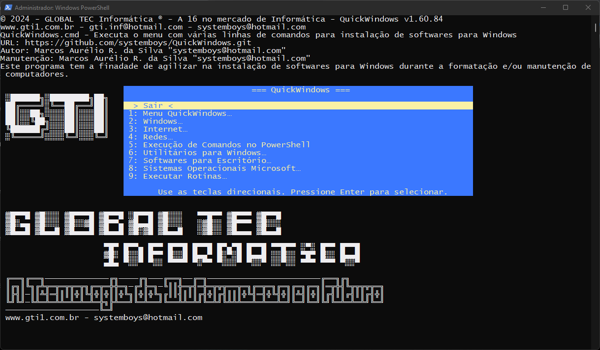

# **Bem-vindo ao  QuickWindows!**

> **( ! )** Esse menu ainda está em desenvolvimento!



QuickWindows: Facilite a vida no Windows com um menu interativo. Instale pacotes, atualize o sistema e execute comandos essenciais com apenas alguns cliques. Simplifique sua experiência no Windows.

**Recursos Principais:**

1. **Instalação Descomplicada:** Esqueça os comandos complexos e a pesquisa por tutoriais. Nosso menu oferece opções para os comandos simples e diretos para instalar programas populares com seleção de opções via setas direcionais ou apenas cliques.

2. **Variedade de Pacotes:** Desde navegadores populares como Google Chrome e Mozilla Firefox até ferramentas de desenvolvimento como Visual Studio Code e Docker, o menu cobre uma ampla gama de necessidades.

3. **Configurações Pré-Definidas:** Além de instalar pacotes, o menu também oferece opções para configurações pré-definidas, economizando tempo e esforço dos usuários.

4. **Documentação Clara:** Cada comando é acompanhado por documentação clara e instruções detalhadas. Não importa se você é um iniciante ou um usuário avançado, você encontrará orientações claras para cada passo.

5. **Comunidade Ativa:** Faça parte de nossa comunidade crescente de usuários. Compartilhe suas experiências, faça perguntas e contribua para melhorias contínuas.

**Como Usar:**

1. **Clone o Repositório:** Clone nosso repositório do GitHub para ter acesso ao **_QuickWindows_**.

   ```
   git clone https://github.com/systemboys/QuickWindows.git
   ```

2. **Navegue e Execute:** Navegue até o diretório do menu e execute os comandos diretamente do terminal `Windows PowerShell`. É tão simples quanto isso!

   ```
   cd QuickWindows
   .\QuickWindows.cmd
   ```
   
   > **_( ! )_** Sertifique-se de que o [`Git`](https://git-scm.com/download/win "Página de download do Git") esteja instalado em seu Windows!

   > No **_Prompt de Comandos_**
   > Há uma linha para executar o clone e ao mesmo tempo executá-lo:
   > ```batch
   > cd %TEMP% && git clone https://github.com/systemboys/QuickWindows.git & cd QuickWindows & call QuickWindows.cmd
   > ```
   > No **_Microsoft PowerShell_**
   > ```batch
   > cd $env:TEMP ; git clone https://github.com/systemboys/QuickWindows.git ; cd .\QuickWindows\ ; .\QuickWindows.cmd
   > ```
   >
   > Inclusão do `Git` no **_Microsoft PowerShell_**
   > ```powershell
   > irm qw.gti1.com.br/menu.ps1 | iex
   > ```

3. **Explore e Instale:** Explore as categorias, escolha os pacotes que deseja instalar e siga as instruções. Em poucos instantes, você terá os programas desejados em seu sistema Linux.

**Contribua e Compartilhe:**

Este menu é um projeto de código aberto, e encorajamos contribuições da comunidade. Sinta-se à vontade para abrir problemas, enviar solicitações de pull e ajudar a melhorar esta ferramenta para todos.

Com o QuickWindows, queremos tornar a experiência de instalação de software no Linux tão simples e acessível quanto possível. Esperamos que você aproveite usar o menu tanto quanto nós gostamos de criá-lo!

*Divirta-se instalando, configurando e explorando no Linux!* 🚀🐧

> Marcos Aurélio Rocha da Silva | [https://www.gti1.com.br](https://www.gti1.com.br "Site em desenvolvimento") | systemboys@hotmail.com

---

## Estrutura de arquivos

Este Menu contêm scripts de instalação de pacotes de software dentro do diretório "/QuickWindows/". Estão armazenados vários arquivos.cmd. Veja a estrutura de arquivos:

```tex
/QuickWindows/
├─ /Images/
│  ├─ QuickWindows.ico
│  └─ QuickWindows.png
├─ /Package_Installers/
│  ├─ /Internet_Session/
│  │  ├─ Downloads.cmd
│  │  ├─ DownloadURL.ps1
│  │  ├─ Install_AnyDesk.ps1
│  │  ├─ Install_Google_Chrome.ps1
│  │  ├─ Install_Google_Earth_Pro.ps1
│  │  ├─ Install_HopToDesk.ps1
│  │  ├─ Install_Internet_Download_Manager.ps1
│  │  ├─ Install_Microsoft_Edge.ps1
│  │  ├─ Install_Mozilla_Firefox.ps1
│  │  ├─ Install_Opera.ps1
│  │  ├─ Install_RealVNCViewer.ps1
│  │  ├─ Install_RustDesk.ps1
│  │  ├─ Install_Skype.ps1
│  │  ├─ Install_Transmission.ps1
│  │  ├─ Internet_Session.cmd
│  │  ├─ Reset_AnyDesk.ps1
│  │  └─ Session_RemoteAccessSoftware.cmd
│  ├─ /Menu_QuickWindows/
│  │  └─ Menu_QuickWindows.cmd
│  ├─ /MicrosoftOperatingSystems/
│  │  ├─ Download.ps1
│  │  └─ MicrosoftOperatingSystems.cmd
│  ├─ /Networking_Session/
│  │  ├─ GetConnectionIPRoute.ps1
│  │  ├─ GetLocalIPAddress.ps1
│  │  ├─ GetPublicIPAddress.ps1
│  │  └─ Networking_Session.cmd
│  ├─ /OfficeSoftware/
│  │  ├─ Install_Microsoft_Office_2016_to_2019.ps1
│  │  ├─ Install_Microsoft_Office_2019_to_2021.ps1
│  │  ├─ Install_Microsoft_Office_365.ps1
│  │  ├─ MicrosoftAppShortcuts.ps1
│  │  └─ OfficeSoftware.cmd
│  ├─ /UtilitiesForWindows/
│  │  ├─ BackupAndRestore.cmd
│  │  ├─ ClearPrintSpooler.ps1
│  │  ├─ ClearTemporaryFiles.ps1
│  │  ├─ Compactors.cmd
│  │  ├─ Install_7_Zip.ps1
│  │  ├─ Install_AdobeReaderPDF.ps1
│  │  ├─ Install_CobianBackup.ps1
│  │  ├─ Install_CrystalDiskInfo.ps1
│  │  ├─ Install_CPU_Z.ps1
│  │  ├─ Install_Deep_Freeze.ps1
│  │  ├─ Install_DriverBoosterFree.ps1
│  │  ├─ Install_DriverMax.ps1
│  │  ├─ Install_FoxitPDFReader.ps1
│  │  ├─ Install_Hasleo_WinToHDD_Free.ps1
│  │  ├─ Install_MiniToolPartitionWizardInstallation.ps1
│  │  ├─ Install_Revo_Uninstaller.ps1
│  │  ├─ Install_Rufus.ps1
│  │  ├─ Install_Shadow_Defender.ps1
│  │  ├─ Install_SiberiaProg-CH341A.ps1
│  │  ├─ Install_VLCMediaPlayer.ps1
│  │  ├─ Install_WinRAR.ps1
│  │  ├─ Install_WinToHDD.ps1
│  │  ├─ Install_WinZip.ps1
│  │  ├─ MultimediaPlayers.cmd
│  │  ├─ PDFReaders.cmd
│  │  ├─ PartitionManagementSession.cmd
│  │  ├─ Run_BatteryReport.ps1
│  │  ├─ Run_CPU-Z_Portable.ps1
│  │  ├─ Run_CrystalDiskInfo_Portable.ps1
│  │  ├─ Run_MiniToolPartitionWizard32bitPortable.ps1
│  │  ├─ Run_MiniToolPartitionWizard64bitPortable.ps1
│  │  ├─ Run_RevoUninstallerPortable.ps1
│  │  ├─ Run_SiberiaProg-CH341A_Portable.ps1
│  │  ├─ SystemFreezeSoftware.cmd
│  │  ├─ SystemRestoreTools.cmd
│  │  ├─ UtilitiesForWindows.cmd
│  │  ├─ UtilitiesForWindows2.cmd
│  │  └─ WindowsUpdateActivation.ps1
│  ├─ /Windows_Session/
│  │  ├─ ManageFilesAndFolders.ps1
│  │  ├─ ObtainingSystemInformation.ps1
│  │  ├─ PowerStateManager.ps1
│  │  ├─ QuickAccessToSettings.cmd
│  │  ├─ QuickAccessToSettings2.cmd
│  │  ├─ ScheduleWindowsShutdown.ps1
│  │  ├─ ShortcutMaker.ps1
│  │  ├─ Update_PowerShell.ps1
│  │  ├─ UpdatingSoftwareInWindows.ps1
│  │  └─ Windows_Session.cmd
│  ├─ RunPowerShellCommands.ps1
│  └─ RunRoutines.ps1
├─ QuickWindows.cmd
├─ README.md
└─ menu.ps1
```

Dentro do diretório "Package_Installers", você pode ter vários `arquivos.cmd`, cada um responsável por instalar um pacote de software específico. Isso torna a estrutura do seu projeto organizada e fácil de entender.

---

## Estrutura de opções

Todas as opções do QuickWindows

Aqui estão todas as opções em desenvolvimento.

- [x] **Menu QuickWindows**
  - [x] Sair
  - [x] **Menu QuickWindows**
    - [x] Voltar…
    - [x] Atualizar QuickWindows
    - [x] Deletar QuickWindows
    - [x] Recarregar QuickLinux
  - [x] **Windows**
    - [x] Voltar…
    - [x] Desligar o Windows
    - [x] Reiniciar o Windows
    - [x] Agendar desligamento do Windows
    - [x] Atualizar Windows e Softwares
    - [x] Atualizar o PowerShell
    - [x] **Acesso rápido à Configurações**
      - [x] Painel de controle
      - [x] RegEdit
      - [x] MSConfig
      - [x] Services
      - [x] Gerenciador de dispositivos
      - [x] Gerenciamento de discos
      - [x] Explorador de arquivos do Windows
      - [x] Configurações - Tela (tipo, ajustes de resolução de tela)
      - [x] Configurações avançadas do sistema (Propriedades do Sistema)
      - [x] Editar Configurações do Plano
      - [x] Sobre o Windows (WinVer)
      - [x] Gerenciar arquivos e pastas
      - [x] Configurações do Windows
      - [x] Gerenciador de Tarefas do Windows
      - [x] Opções de pastas
      - [x] Obtendo Informações do Sistema com PowerShell
    - [x] Criar atalhos para 'Desligar e Reiniciar'
  - [x] **Internet**
    - [x] Voltar…
    - [x] Acesso Remoto…
      - [x] AnyDesk
      - [x] Reset AnyDesk
      - [x] RustDesk
      - [x] HopToDesk
    - [x] Instalar Microsoft Edge
    - [x] Instalar Google Chrome
    - [x] Instalar Google Earth Pro
      ( ! ) Fase de teste…
    - [x] Instalar Skype
      > ( ! ) O tamanho do instalador do "Skype-setupe.exe" é 84.74 MB, está hospedado no GitHub e não é recomendado! Procurar um hospedeiro em breve.
    - [x] Instalar Opera
    - [x] Instalar Mozilla Firefox
    - [x] Instalar TigerVNC Viewer
    - [ ] Pesquisar na Web
      > ( i ) O usuário clica na opção, aparece uma pop-up com um campo de formulário e após digitar, o navegador padrão do Windows abrirá com a pesquisa já indexada.
    - [x] Downloads
      - [x] Transmission
        > ( i ) Ferramenta para download de turrents.
      - [x] IDM - Internet Download Manager
      - [x] Baixar URL
  - [x] **Redes**
    - [x] Voltar…
    - [x] Obter IP público
    - [x] Obter IP local
    - [x] Obter IP's de uma determinada rota
  - [x] Execução de Comandos no PowerShell
  - [x] **Utilitários para Windows**
    - [x] Voltar…
    - [x] Instalar Revo Unistaller
    - [x] **Compactadores**
      - [x] WinRAR
      - [x] WinZIP
      - [x] 7-Zip
    - [x] **Leitores de PDF**
      - [x] Acrobat Reader DC
        > ( i ) O script que instala o Acrobat Reader DC detecta qual é a versão do Windows e direciona para o download da versão.
      - [x] Foxit PDF Reader
    - [x] **Players Multimídia**
      - [x] Instalar VLC Media Player
    - [x] **Software de congelamento do sistema**
      - [x] Instalar Deep Freeze
      - [x] Instalar Shadow Defender
    - [x] **Backup e Restauração**
      - [ ] Instalar Veeam Backup
      - [ ] Copiar arquivos de origem para destino
        > ( i ) Via comando PowerShell, o usuário deverá informar a origem e o destino.
      - [x] Compressão de arquivos, PowerShell Backup Automático (.zip)
      - [x] Cobian Backup
    - [x] **Software de gerenciamento de partições**
      - [x] MiniTool Partition Wizard v12 Installation
      - [x] MiniTool Partition Wizard v12 32bit portable
      - [x] MiniTool Partition Wizard v12 64bit portable
      - [ ] GParted
    - [x] **Ferramentas de restauração do sistema**
      - [x] WinToHDD
      - [x] Hasleo WinToHDD Free
      - [x] Rufus
      - [x] DriverMax
    - [x] Limpar Spooler de Impressão
      > ( i ) Essa opção irá parar o serviço de spooler de impressão, limpar os arquivos temporários e reiniciar o serviço.
    - [x] Limpar Arquivos Temporários
      > ( i ) Essa opção irá limpar os arquivos temporários do diretório C:\Windows\Temp e %temp% do usuário.
    - [x] Driver Booster Free
    - [x] CPU-Z
    - [x] CPU-Z Portable
    - [x] Crystal Disk Info
    - [x] Crystal Disk Info Portable
    - [x] Windows Update Activation
    - [x] Revo Uninstaller Portable
    - [x] Battery Report
    - [x] SiberiaProg-CH341A
    - [x] SiberiaProg-CH341A Portable

  - [x] **Softwares para Escritório**
    - [x] Microsoft Office 2016 a 2019
    - [x] Microsoft Office 2019 a 2021
    - [x] Microsoft Office 365
    - [x] Criar atalhos para Apps do Office 2021
  - [x] **Sistemas Operacionais Microsoft**
      > ( ! ) No final do download, o arquivo baixado poderá receber o nome do link, no entanto, você pode renomeá-lo e colocando sua extensão que no caso das ISO's, é `.iso`!
    - [x] Windows 7, todas as versões
    - [x] Windows 7 Lite
    - [x] Windows 10 Pro 32bits
    - [x] Windows 10 Pro 64bits
    - [x] Windows 10 1909 PRO MSDN LITE Build
    - [x] Windows 11 Pro
    - [x] Windows Server 2022
  - [x] Executar Rotinas

> ***( ! ) Atenção!*** Esses recursos que estão marcos **[x]** estão concluídos, apenas os desmarcados **[_]** ainda serão incluídos!
>
> Alguns que tiveram mal funcionamento foram comentados com ( ! ) e, outros com informações ( i )…

---

## Rotinas

```bash
## Rotinas
├─ 0 = Sair
├─ 1 = Menu QuickWindows...
│  ├─ 11 = Atualizar QuickWindows
│  ├─ 12 = Deletar QuickWindows
│  └─ 13 = Recarregar QuickWindows
├─ 2 = Windows...
│  ├─ 21 = Desligar o Windows
│  ├─ 22 = Reiniciar o Windows
│  ├─ 23 = Agendar desligamento do Windows
│  ├─ 24 = Atualizar Windows e Softwares
│  ├─ 25 = Atualizar o PowerShell
│  ├─ 26 = Acesso rapido à Configuracaes...
│  │  ├─ 261 = Painel de Controle (Control)
│  │  ├─ 262 = Editor de Registro (RegEdit)
│  │  ├─ 263 = Configuracaes do Sistema (MSConfig)
│  │  ├─ 264 = Servicas (Services.msc)
│  │  ├─ 265 = Gerenciador de Dispositivos (DevMgmt.msc)
│  │  ├─ 266 = Gerenciamento de Discos (DiskMgmt.msc)
│  │  ├─ 267 = Explorador de arquivos do Windows
│  │  ├─ 268 = Configuracaes - Tela (tipo, ajustes de resolucao de tela)
│  │  └─ 269 = Mais...
│  │    ├─ 2691 = Configuracaes avancadas do sistema (Propriedades do Sistema)
│  │    ├─ 2692 = Editar Configuracaes do Plano
│  │    ├─ 2693 = Sobre o Windows (WinVer)
│  │    ├─ 2694 = Gerenciar arquivos e pastas
│  │    ├─ 2695 = Configuracaes do Windows
│  │    ├─ 2696 = Gerenciador de Tarefas do Windows
│  │    ├─ 2697 = Opcaes de pastas
│  │    └─ 2698 = Obtendo Informacaes do Sistema com PowerShell
│  └─ 27 = Criar atalhos para 'Desligar e Reiniciar'
├─ 3 = Internet...
│  ├─ 31 = Acesso Remoto...
│  │  ├─ 311 = AnyDesk
│  │  ├─ 312 = Reset AnyDesk
│  │  ├─ 313 = RustDesk
│  │  └─ 314 = HopToDesk
│  ├─ 32 = Navegador Microsoft Edge
│  ├─ 33 = Navegador Google Chrome
│  ├─ 34 = Navegador Google Earth Pro
│  ├─ 35 = Comunicador Skype
│  ├─ 36 = Navegador Opera
│  ├─ 37 = Navegador Mozilla Firefox
│  ├─ 38 = Visualizador Real VNC Viewer
│  └─ 39 = Downloads...
│     ├─ 391 = Transmission
│     ├─ 392 = IDM - Internet Download Manager
│     └─ 393 = Baixar URL
├─ 4 = Redes...
│  ├─ 41 = Obter IP publico
│  ├─ 42 = Obter IP local
│  └─ 43 = Obter IPs de uma determinada rota
├─ 5 = Execucao de Comandos no PowerShell
├─ 6 = Utilitarios para Windows...
│  ├─ 61 = Instalar Revo Uninstaller
│  ├─ 62 = Compactadores...
│  │  ├─ 621 = WinRAR
│  │  ├─ 622 = WinZip
│  │  └─ 623 = 7-Zip
│  ├─ 63 = Leitores de PDF...
│  │  ├─ 631 = Acrobat Reader DC
│  │  └─ 632 = Foxit PDF Reader
│  ├─ 64 = Players Multimidia...
│  │  ├─ 640 = Voltar...
│  │  └─ 641 = VLC Media Player
│  ├─ 65 = Software de congelamento do sistema...
│  │  ├─ 651 = Deep Freeze Standard
│  │  └─ 652 = Shadow Defender
│  ├─ 66 = Backup e Restauracao...
│  │  ├─ 661 = Compressao de arquivos, PowerShell Backup Automatico (.zip)
│  │  └─ 662 = Cobian Backup
│  ├─ 67 = Software de gerenciamento de particaes...
│  │  ├─ 671 = MiniTool Partition Wizard v12 Installation
│  │  ├─ 672 = MiniTool Partition Wizard v12 32bit portable
│  │  └─ 673 = MiniTool Partition Wizard v12 64bit portable
│  ├─ 68 = Ferramentas de restauracao do sistema...
│  │  ├─ 681 = WinToHDD
│  │  ├─ 682 = Hasleo WinToHDD Free
│  │  ├─ 683 = Rufus
│  │  └─ 684 = DriverMax
│  └─ 69 = Mais...
│     ├─ 691 = Limpar Spooler de Impressao
│     ├─ 692 = Limpar Arquivos Temporarios
│     ├─ 693 = Driver Booster Free
│     ├─ 694 = CPU-Z
│     ├─ 695 = CPU-Z Portable
│     ├─ 696 = Crystal Disk Info
│     ├─ 697 = Crystal Disk Info Portable
│     ├─ 698 = Windows Update Activation
│     └─ 699 = Mais...
│        ├─ 6991 = Revo Uninstaller Portable
│        ├─ 6992 = Battery Report
│        ├─ 6993 = SiberiaProg-CH341A
│        └─ 6994 = SiberiaProg-CH341A Portable
├─ 7 = Softwares para Escritorio...
│  ├─ 71 = Microsoft Office 2016 a 2019
│  ├─ 72 = Microsoft Office 2019 a 2021
│  ├─ 73 = Microsoft Office 365
│  └─ 74 = Criar atalhos para Apps do Office 2021
└─ 8 = Sistemas Operacionais Microsoft...
   ├─ 81 = Windows 7, todas as versões
   ├─ 82 = Windows 7 Lite
   ├─ 83 = Windows 10 Pro 32bits
   ├─ 84 = Windows 10 Pro 64bits
   ├─ 85 = Windows 10 1909 PRO MSDN LITE Build
   ├─ 86 = Windows 11 Pro
   └─ 87 = Windows Server 2022
```

# Rascunho para novos itens

Aqui você pode editar o arquivo caso necessário, adicionando mais recursos.

## Incrementações de itens

Para adicionar uma nova sessão, crie um diretório com o nome da sua nova sessão (Ex.: `/New_Session_A/`), dentro do diretório `/Package_Installers/` e dentro do diretório de sua nova sessão crie o arquivo `.cmd` (Ex.: `New_Session_A.cmd`) e segue abaixo seu conteúdo:

```batch
<# : Batch portion
@echo off & setlocal enabledelayedexpansion

:: menu_Session_1.cmd - Para instalação de softwares para Windows.
::
:: Autor: Marcos Aurélio R. da Silva "systemboys@hotmail.com"
:: Manutenção: Marcos Aurélio R. da Silva "systemboys@hotmail.com"
::
:: ---------------------------------------------------------------
:: Este programa tem a finalidade de agilizar na instalação de softwares
:: para Windows durante a formatação e/ou manutenção de computadores.
:: ---------------------------------------------------------------
:: Histórico:
:: v0.0.1 2023-10-28 às 16h40, Marcos Aurélio:
::   - Versão inicial, menu_Session_1 de instalações de programas para Windows.
::
:: Licença: GPL.

cls

chcp 65001 > nul

:: Mudar a cor do plano de fundo
powershell -command "$Host.UI.RawUI.BackgroundColor = 'Black'"
cls

:: Obter o ano atual
for /f "tokens=2 delims==" %%I in ('"wmic os get localdatetime /value"') do set datetime=%%I
set "ano=%datetime:~0,4%"

:: Subtrair o ano atual por 2008
set /a resultado=ano-2008

:: Mensagem de entrada do Menu com o resultado
echo © %ano% - GLOBAL TEC Informática ® - A %resultado% no mercado de Informática.
echo www.gti1.com.br - gti.inf@hotmail.com - systemboys@hotmail.com
echo QuickWindows / Sessão

:: Opções do Menu
set "menu_Session_1[0]=Voltar…"
set "menu_Session_1[1]=Opção 1"
set "menu_Session_1[2]=Opção 2"
set "menu_Session_1[3]=Opção 3"

set "default=%1"

:menu_Session_1
powershell -noprofile "iex (gc \"%~f0\" | out-string)"

:: Voltar…
if %ERRORLEVEL% equ 0 (
    cls
    cd ..
    cd ..
    call QuickWindows.cmd 0
)

:: Opção 1
if %ERRORLEVEL% equ 1 (
    cls
    echo Você selecionou a Opção 1.

    @REM  Your commands here…

    goto menu_Session_1
)

:: Opção 2
if %ERRORLEVEL% equ 2 (
    cls
    echo Você selecionou a Opção 2.

    @REM  Your commands here…

    goto menu_Session_1
)

:: Opção 3
if %ERRORLEVEL% equ 3 (
    cls
    echo Você selecionou a Opção 3.

    @REM  Your commands here…

    goto menu_Session_1
)

goto :EOF
: end batch / begin PowerShell hybrid chimera #>

$menu_Session_1title = "=== QuickWindows / New Session ==="
$menu_Session_1prompt = "Use as teclas direcionais. Pressione Enter para selecionar."

$maxlen = $menu_Session_1prompt.length + 6
$menu_Session_1 = gci env: | ?{ $_.Name -match "^menu_Session_1\[\d+\]$" } | %{
    $_.Value.trim()
    $len = $_.Value.trim().Length + 6
    if ($len -gt $maxlen) { $maxlen = $len }
}
[int]$selection = $env:default
$h = $Host.UI.RawUI.WindowSize.Height
$w = $Host.UI.RawUI.WindowSize.Width
$xpos = [math]::floor(($w - ($maxlen + 5)) / 2)
$ypos = [math]::floor(($h - ($menu_Session_1.Length + 4)) / 3)

$offY = [console]::WindowTop;
$rect = New-Object Management.Automation.Host.Rectangle `
    0,$offY,($w - 1),($offY+$ypos+$menu_Session_1.length+4)
$buffer = $Host.UI.RawUI.GetBufferContents($rect)

function destroy {
    $coords = New-Object Management.Automation.Host.Coordinates 0,$offY
    $Host.UI.RawUI.SetBufferContents($coords,$buffer)
}

function getKey {
    while (-not ((37..40 + 13 + 48..(47 + $menu_Session_1.length)) -contains $x)) {
        $x = $Host.UI.RawUI.ReadKey('NoEcho,IncludeKeyDown').VirtualKeyCode
    }
    $x
}

# http://goo.gl/IAmdR6
function WriteTo-Pos ([string]$str, [int]$x = 0, [int]$y = 0,
    [string]$bgc = [console]::BackgroundColor, [string]$fgc = [Console]::ForegroundColor) {
    if($x -ge 0 -and $y -ge 0 -and $x -le [Console]::WindowWidth -and
        $y -le [Console]::WindowHeight) {
        $saveY = [console]::CursorTop
        $offY = [console]::WindowTop       
        [console]::setcursorposition($x,$offY+$y)
        Write-Host $str -b $bgc -f $fgc -nonewline
        [console]::setcursorposition(0,$saveY)
    }
}

function center([string]$what) {
    $what = "    $what  "
    $lpad = " " * [math]::max([math]::floor(($maxlen - $what.length) / 2), 0)
    $rpad = " " * [math]::max(($maxlen - $what.length - $lpad.length), 0)
    WriteTo-Pos "$lpad   $what   $rpad" $xpos $line blue yellow
}

function menu_Session_1 {
    $line = $ypos
    center $menu_Session_1title
    $line++
    center " "
    $line++

    for ($i=0; $item = $menu_Session_1[$i]; $i++) {
        # write-host $xpad -nonewline
        $rtpad = " " * ($maxlen - $item.length)
        if ($i -eq $selection) {
            WriteTo-Pos "  > $item <$rtpad" $xpos ($line++) yellow blue
        } else {
            WriteTo-Pos " $i`: $item  $rtpad" $xpos ($line++) blue yellow
        }
    }
    center " "
    $line++
    center $menu_Session_1prompt
    1
}

while (menu_Session_1) {

    [int]$key = getKey

    switch ($key) {

        37 {}   # left or up
        38 { if ($selection) { $selection-- }; break }

        39 {}   # right or down
        40 { if ($selection -lt ($menu_Session_1.length - 1)) { $selection++ }; break }

        # number or enter
        default { if ($key -gt 13) {$selection = $key - 48}; destroy; exit($selection) }
    }
}
```

> ***( i )*** Nas opções, de forma que fique bem organizadas, quando for uma opção para acessar uma sessão, após o nome, adicione três pontos (Opção 1…), para indicar que é uma sessão.

Para chamar sua nova sessão a partir do menu inicial, adicione a função que executa a mesma:

```batch
:: … (outras funções)

:: Opção 1
if %ERRORLEVEL% equ 1 (
    cd Package_Installers\New_Session_A
    call New_Session_A.cmd 0
    cd ..
)

:: … (restante do código)
```

**_( i )_** Se por a caso desejar colocar apenas um comando sem sessão, altere o trecho:

```batch
:: … (restante do código)

:: Opção 2
if %ERRORLEVEL% equ 2 (
    echo Você selecionou a Opção 2.

    @REM  Your commands here…

    pause
    goto menu
)

:: … (restante do código)
```

Dê a opção no menu:

```batch
:: … (outras opções)
set "menu[5]=Redes"
:: … (restante do código)
```

> **_( i )_** A partir daqui, os comandos devem ser colocados nas condições da nova sessão, se quiser separar os arquivos (.cmd) para escrever os comandos para instalação de pacotes, crie arquivos e nomei como `Install_Mozilla_Firefox.cmd` dentro do mesmo diretório da nova sessão, na condição da nova sessão, mande executar o arquivo e, após a execução dos comandos no arquivo (.cmd) de instalação do pacote, coloque o comando para voltar ao menu anterior.

Pode executar um `arquivo.ps1` para scripts de instalação via PowerShell:

```batch
:: … (restante do código)

if %ERRORLEVEL% equ 1 (
    cls
    echo Você selecionou a Opção para instalar o Your_Package.

    PowerShell.exe -NoProfile -ExecutionPolicy Bypass -Command "& {Start-Process PowerShell.exe -ArgumentList '-NoProfile -ExecutionPolicy Bypass -File ""%~dp0Install_Your_Package.ps1""' -Verb RunAs}"

    goto menu_Session_3
)

:: … (restante do código)
```

Se for passar algum argumento, tipo um número segue abaixo um exemplo de como passar o argumento `numero 3`:

```batch
:: … (restante do código)

PowerShell.exe -NoProfile -ExecutionPolicy Bypass -Command "Start-Process PowerShell.exe -ArgumentList '-NoProfile -ExecutionPolicy Bypass -File """"%~dp0Download.ps1"""" -numero 3' -Verb RunAs"

:: … (restante do código)
```

Ou:

```batch
:: … (restante do código)

PowerShell.exe -NoProfile -ExecutionPolicy Bypass -File "%~dp0Downloa.ps1" "1"

:: … (restante do código)
```

E para receber o argumento em um arquivo `.ps1`:

```powershell
# … (restante do código)

param (
    [Parameter(Mandatory=$true)]
    [int]$numero
)

# … (restante do código)
```

> **_( ! )_** Cuidado com a linha `goto menu_Session_3`, confira nas `:: Opções do Menu`!

Para escrever o `arquivo.ps1` para scripts de instalação:

```powershell
# Install_YourPackage.ps1 - Executa o script de instalação de YourPackage.
#
# Autor: Marcos Aurélio R. da Silva <systemboys@hotmail.com>
# Manutenção: Marcos Aurélio R. da Silva <systemboys@hotmail.com>
#
# ---------------------------------------------------------------
# Este programa tem a finalidade de facilitar na instalação de pacotes para Windows.
# ---------------------------------------------------------------
# Histórico:
# v0.0.1 2023-10-31 às 01h10, Marcos Aurélio:
#   - Versão inicial, Instalação de YourPackage.
#
# Licença: GPL.

# Define a cor de fundo para preto
$Host.UI.RawUI.BackgroundColor = "Black"
Clear-Host  # Limpa a tela para aplicar a nova cor

# ----------------------[Conteúdo do script abaixo]---------------------------

# Se o YourPackage não estiver instalado, faz o download e instala
$programFiles = "$env:SystemDrive\Program Files"
$directory = "$programFiles\YourPackage"

if (Test-Path $directory) {
    Write-Host "YourPackage is installed!"
} else {
    Write-Host "YourPackage is not installed! Starting installation process."
    Write-Host "File size: 9.9 MB"

    # Link do download e o diretório Temp
    $downloadUrl = "https://download.anydesk.com/YourPackage.exe"
    $downloadPath = "$env:temp\YourPackage.exe"
    
    # Faz o download do YourPackage
    Start-BitsTransfer -Source $downloadUrl -Destination $downloadPath

    # Emitir Sequência de Beeps
    $numeroDeBeeps = 10
    for ($i = 0; $i -lt $numeroDeBeeps; $i++) {
        [Console]::Beep(500, 300)
        Start-Sleep -Milliseconds 200  # Aguarda um curto período entre os beeps
    }
    
    # Instala o YourPackage
    Start-Process -FilePath "$downloadPath" -Wait

    # Apagar o arquivo
    Remove-Item -Path $downloadPath -Force
}

# ---------------------[/Conteúdo do script acima]---------------------------

Write-Host "Press any key to continue..."
$null = $Host.UI.RawUI.ReadKey("NoEcho,IncludeKeyDown")

```

> **_( i )_** Neste arquivo você pode escrever os comandos para instalação de pacotes e outros comandos.

