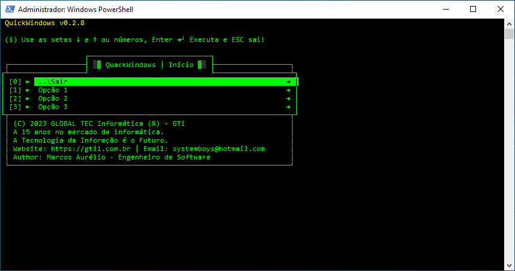

# **Bem-vindo ao  QuickWindows!**

> **( ! )** Esse menu ainda está em desenvolvimento!



QuickWindows: Facilite a vida no Windows com um menu interativo. Instale pacotes, atualize o sistema e execute comandos essenciais com apenas alguns cliques. Simplifique sua experiência no Windows.

**Recursos Principais:**

1. **Instalação Descomplicada:** Esqueça os comandos complexos e a pesquisa por tutoriais. Nosso menu oferece opções para os comandos simples e diretos para instalar programas populares com seleção de opções via setas direcionais ou apenas cliques.

2. **Variedade de Pacotes:** Desde navegadores populares como Google Chrome e Mozilla Firefox até ferramentas de desenvolvimento como Visual Studio Code e Docker, o menu cobre uma ampla gama de necessidades.

3. **Configurações Pré-Definidas:** Além de instalar pacotes, o menu também oferece opções para configurações pré-definidas, economizando tempo e esforço dos usuários.

4. **Documentação Clara:** Cada comando é acompanhado por documentação clara e instruções detalhadas. Não importa se você é um iniciante ou um usuário avançado, você encontrará orientações claras para cada passo.

5. **Comunidade Ativa:** Faça parte de nossa comunidade crescente de usuários. Compartilhe suas experiências, faça perguntas e contribua para melhorias contínuas.

**Como Usar:**

1. **Clone o Repositório:** Clone nosso repositório do GitHub para ter acesso ao **_QuickWindows_**.

   ```
   git clone https://github.com/systemboys/QuickWindows.git
   ```

2. **Navegue e Execute:** Navegue até o diretório do menu e execute os comandos diretamente do terminal `Windows PowerShell`. É tão simples quanto isso!

   ```
   cd QuickWindows
   .\QuickWindows.ps1
   ```
   
   > **_( ! )_** Sertifique-se de que o [`Git`](https://git-scm.com/download/win "Página de download do Git") esteja instalado em seu Linux!

   > No **_Prompt de Comandos_**
   > Há uma linha para executar o clone e ao mesmo tempo executá-lo:
   > ```batch
   > cd %TEMP% && git clone https://github.com/systemboys/QuickWindows.git & cd QuickWindows & call QuickWindows.ps1
   > ```
   > No **_Microsoft PowerShell_**
   > ```batch
   > cd $env:TEMP ; git clone https://github.com/systemboys/QuickWindows.git ; cd .\QuickWindows\ ; .\QuickWindows.ps1
   > ```
   >
   > Inclusão do `Git` no **_Microsoft PowerShell_**
   > ```powershell
   > irm https://qw.gti1.com.br/menu.ps1 | iex
   > ```

3. **Explore e Instale:** Explore as categorias, escolha os pacotes que deseja instalar e siga as instruções. Em poucos instantes, você terá os programas desejados em seu sistema Linux.

**Contribua e Compartilhe:**

Este menu é um projeto de código aberto, e encorajamos contribuições da comunidade. Sinta-se à vontade para abrir problemas, enviar solicitações de pull e ajudar a melhorar esta ferramenta para todos.

Com o QuickWindows, queremos tornar a experiência de instalação de software no Linux tão simples e acessível quanto possível. Esperamos que você aproveite usar o menu tanto quanto nós gostamos de criá-lo!

*Divirta-se instalando, configurando e explorando no Linux!* 🚀🐧

> Marcos Aurélio Rocha da Silva | [https://www.gti1.com.br](https://www.gti1.com.br "Site em desenvolvimento") | systemboys@hotmail.com

---

## Estrutura de arquivos

Este Menu contêm scripts de instalação de pacotes de software dentro do diretório "/QuickWindows/". Estão armazenados vários arquivos.ps1. Veja a estrutura de arquivos:

```batch
/QuickWindows
├─ /Imagens/
│  └─ QuickWindows.png
├─ /Package_Installers/
│  ├─ /Internet_Session/
│  │  ├─ globalFunctions.ps1
│  │  ├─ Internet_Session.ps1
│  │  ├─ Install_Package1.ps1
│  │  ├─ Install_Package2.ps1
│  │  ├─ Install_Package3.ps1
│  │  └─ ...
│  ├─ /Menu_QuickWindows/
│  │    └─ Menu_QuickWindows.ps1
│  ├─ /Networking_Session/
│  │  ├─ globalFunctions.ps1
│  │  ├─ Networking_Session.ps1
│  │  ├─ Install_Package3.ps1
│  │  └─ ...
│  └─ /Windows_Session/
│     ├─ globalFunctions.ps1
│     ├─ Windows_Session.ps1
│     ├─ Install_Package1.ps1
│     └─ ...
├─ globalVariables.ps1
├─ QuickWindows.ps1
└─ README.md
```

Dentro do diretório "Package_Installers", você pode ter vários `arquivos.ps1`, cada um responsável por instalar um pacote de software específico. Isso torna a estrutura do seu projeto organizada e fácil de entender.

# Rascunho para novos itens

Aqui você pode editar o arquivo caso necessário, adicionando mais recursos.

## Incrementações de itens

A princípio, crie o arquivo principal.

***MenuInterativo.ps1***
```powershell
<#
MenuInterativo.ps1 - Executa o menu com opções personalizadas.

URL: https://github.com/systemboys/QuickWindows.git
Autor: Marcos Aurélio R. da Silva "systemboys@hotmail.com"
Manutenção: Marcos Aurélio R. da Silva "systemboys@hotmail.com"

---------------------------------------------------------------
Este programa tem a finalidade de disponibilizar opções personalizadas
para serem selecionadas com uso de setas direcionais.
---------------------------------------------------------------
Histórico:
v0.0.1 2023-11-19 às 23h01, Marcos Aurélio:
  - Versão inicial, começo do script...

Licença: GPL.
#>

# Get the name of the current script file
$currentFileName = $MyInvocation.MyCommand.Name

# Adjusting PowerShell window dimensions
$width = "120"
$height = "30"
$size = New-Object System.Management.Automation.Host.Size($width, $height)
$host.UI.RawUI.WindowSize = $size

# Colors
$Host.UI.RawUI.BackgroundColor = "Black" # Background
$Host.UI.RawUI.ForegroundColor = "Green" # Font

# Optoin Functions
. .\optionFunctions.ps1

# Globla Variables
. .\globalVariables.ps1

# Option Menu
. .\menuOptions.ps1

# Region FUNCTIONS

# Function used to simply revert console colors
function Reverse-Colors {
    $bColor = [System.Console]::BackgroundColor
    $fColor = [System.Console]::ForegroundColor
    [System.Console]::BackgroundColor = $fColor
    [System.Console]::ForegroundColor = $bColor    
}

# Main function showing the menu
function New-Menu {
    param(
        [parameter(Mandatory=$true)][System.Collections.Generic.List[string]]$menuItems, # Contains all menu items
        [string]$title       = $title,                                                   # The title for the menu
        [string]$hint        = $hint,                                                    # Hint to be displayed above menu entries
        [string]$footer      = $footer,                                                  # Menu footer
        [ValidateSet("green","yellow","red","black","white")]                            # You might add more colors allowed by console
        [string]$titleColor  = 'Yellow'                                                  # Color of the title
    )
    
    # Prepare variables with function wide scope
    $invalidChoice = $false                     # Initialize the flag indicating whether an ivalid key was pressed
    $selectIndex   = 0                          # Initialize the variable storing the selection index (by default the first entry)
    $outChar       = 'a'                        # Initialize the variable storing the Enter or Esc value

    # Prepare the cosnole
    [System.Console]::CursorVisible = $false    # Hide the cursor, we don't need it
    [Console]::Clear()                          # Clear everything before showing the menu

    # Main loop showing all the entries and handling the interaction with user
    # End the loop only when Enter or Escape is pressed
    while (([System.Int16]$inputChar.Key -ne [System.ConsoleKey]::Enter) -and ([System.Int16]$inputChar.Key -ne [System.ConsoleKey]::Escape)) {
        
        # Show title and hint
        [System.Console]::CursorTop = 0                     # Start from top and then overwrite all lines; it's used instead of Clear to avoid blinking
        $tempColor = [System.Console]::ForegroundColor      # Keep the default font color 
        [System.Console]::ForegroundColor = $titleColor     # Set the color for title according to value of parameter
        [System.Console]::WriteLine("$title`n")             # The title for the menu
        [System.Console]::ForegroundColor = $tempColor      # Revert back to default font color
        
        [System.Console]::WriteLine($hint)
        [System.Console]::WriteLine($header)
        # Show all entries
        for ($i = 0; $i -lt $menuItems.Count; $i++) {
            [System.Console]::Write("$leftSideEdge ► [$i] ")                    # Add identity number to each entry, it's not highlighted for selection but it's in the same line
            if ($selectIndex -eq $i) {
                Reverse-Colors                                      # In case this is the selected entry, reverse color just for it to make the selection visible
                [System.Console]::WriteLine($menuItems[$i] + "◄ $rightSideEdge")
                Reverse-Colors      
            } else {
                [System.Console]::WriteLine($menuItems[$i] + "◄ $rightSideEdge") # In case this is not-selected entry, just show it
            }
        }
        [System.Console]::WriteLine($footer)

        # In case of invalid key, show the message
        if ($invalidChoice) {
            [System.Console]::WriteLine("Invalid button! Try again...")
        } else {
            [System.Console]::Write([System.String]::new(' ',[System.Console]::WindowWidth)) # In case the valid key was used after invalid, clean-up this line
            [System.Console]::SetCursorPosition(0,[System.Console]::CursorTop)               # Set the cursor back to first column so it's properly back to 1st column, 1st row in next iteration of the loop
        }
        $invalidChoice = $false                                                              # Reset the invalid key flag

        # Read the key from user
        $inputChar=[System.Console]::ReadKey($true)

        # Try to convert it to number
        try {
            $number = [System.Int32]::Parse($inputChar.KeyChar)
        }
        catch{
            $number = -1                                                                     # In case it's not a valid number, set to always invalid -1
        }
        
        # Hanlde arrows
        if ([System.Int16]$inputChar.Key -eq [System.ConsoleKey]::DownArrow){
            if ($selectIndex -lt $menuItems.Count -1) {                                       # Avoid selection out of range
                $selectIndex++
            }
        } elseif ([System.Int16]$inputChar.Key -eq [System.ConsoleKey]::UpArrow){
            if ($selectIndex -gt 0){                                                         # Avoid selection out of range
                $selectIndex--
            }
        } elseif ($number -ge 0 -and $number -lt $menuItems.Count){                          # If it's valid number within the range
            # Handle double-digit numbers
            $timestamp = Get-Date       
            while (![System.Console]::KeyAvailable -and ((get-date) - $timestamp).TotalMilliseconds -lt 500){
                Start-Sleep -Milliseconds 250                                               # Give the user 500 miliseconds to type in the 2nd digit, check after 250 to improve responsivness
            }
            if ([System.Console]::KeyAvailable) {                                            # If user typed a key, read it in next line
                $secondChar = [System.Console]::ReadKey($true).KeyChar
                $fullChar   = "$($inputChar.KeyChar)$($secondChar)"                         # Join both keys
                try {
                    # Set selection
                    $number = [System.Int32]::Parse($fullChar)                              # Set the selection accordingly or raise flag for invalid key
                    if ($number -ge 0 -and $number -lt $menuItems.Count) {
                        $selectIndex   = $number
                    } else {
                        $invalidChoice = $true
                    }                
                }
                catch {
                    $invalidChoice = $true
                }
            } else {
                # Set selection
                $selectIndex = $number                                                       # Set selection for single digit number
            }
        } else {
            $invalidChoice = $true                                                           # Key not recognized, raise the flag
        }
        $outChar = $inputChar                                                                # Assign the key value to variable with scope outside the loop
    }

    # Hanlde the result, just show the selected entry if Enter was pressed; do nothing if Escape was pressed
    if ($outChar.Key -eq [System.ConsoleKey]::Enter) {
        [Console]::WriteLine(" You selected $($menuItems[$selectIndex])")
        Invoke-Command -ScriptBlock (Get-Command "menuOption_$selectIndex").ScriptBlock
    }
}

# Endregion FUNCTIONS

# Region MAIN SCRIPT

# Show the menu
do {
    New-Menu $menuItems
} while ($outChar.Key -ne [System.ConsoleKey]::Escape)

#endregion MAIN SCRIPT
```

Crie outro arquivo para colocar as opções do menu.

***menuOptions.ps1***
```powershell
<#
menuOptions.ps1 - Exporta as variáveis para outros arquivos.

Autor: Marcos Aurélio R. da Silva "systemboys@hotmail.com"
Manutenção: Marcos Aurélio R. da Silva "systemboys@hotmail.com"

---------------------------------------------------------------
Este programa tem a finalidade de exportar variáveis para outros arquivos.
---------------------------------------------------------------
Histórico:
v0.0.1 2023-11-19 às 23h01, Marcos Aurélio:
  - Versão inicial, variáveis globais.

Licença: GPL.
#>

# Populate menuItems with example entries
$menuItems = [System.Collections.Generic.List[string]]::new()
$menuItems.Add("..\Exit                                                     ")
$menuItems.Add("Option 1                                                    ")
$menuItems.Add("Option 2                                                    ")
$menuItems.Add("Option 3                                                    ")
```

Crie outro arquivo para colocar as variáveis globais, onde estão o layout do menu como informações, moldura etc.

***globalVariables.ps1***
```powershell
<#
globalVariables.ps1 - Exporta as variáveis para outros arquivos.

Autor: Marcos Aurélio R. da Silva "systemboys@hotmail.com"
Manutenção: Marcos Aurélio R. da Silva "systemboys@hotmail.com"

---------------------------------------------------------------
Este programa tem a finalidade de exportar variáveis para outros arquivos.
---------------------------------------------------------------
Histórico:
v0.0.1 2023-11-19 às 23h01, Marcos Aurélio:
  - Versão inicial, variáveis globais.

Licença: GPL.
#>

# Definition of variables
$currentYear = Get-Date -Format yyyy
$timeOnMarket = ($currentYear - 2008)

# Display
$title  = " QuickWindows v0.2.8"
$hint   = " (i) Use as setas ↓ e ↑ ou números, Enter ◄┘ Executa e ESC sai!`n"
$header = "                     ┌───────────────────────────┐
 ┌───────────────────┤░▒▓ QuackWindows | Home ▓▒░├───────────────────┐
┌┴───────────────────┘                           └───────────────────┴┐"
$leftSideEdge = "│"
# The menu options are posted here from the "menuOptions".ps1 file
$rightSideEdge = "│"
$footer = "└┬─────────────────────────────────────────────────────────────┬─┬─┬─┬┘
 │ (C) $currentYear GLOBAL TEC Informática (R) - GTi                     - ┼ ┤
 │ A $timeOnMarket anos no mercado de informática.                            - ┤
 │ A Tecnologia da Informção é o Futuro.                             ┤
 │ Website: https://gti1.com.br | Email: systemboys@hotmail.com    - ┤
 │ Author: Marcos Aurélio - Engenheiro de Software               - ┼ ┤
 └─────────────────────────────────────────────────────────────┴─┴─┴─┘"
```

Crie outro arquivo para colocar as funções que serão executadas após selecionar as opções.

***optionFunctions.ps1***
```powershell
<#
optionFunctions.ps1 - Exporta as variáveis para outros arquivos.

Autor: Marcos Aurélio R. da Silva "systemboys@hotmail.com"
Manutenção: Marcos Aurélio R. da Silva "systemboys@hotmail.com"

---------------------------------------------------------------
Este programa tem a finalidade de exportar variáveis para outros arquivos.
---------------------------------------------------------------
Histórico:
v0.0.1 2023-11-19 às 23h01, Marcos Aurélio:
  - Versão inicial, variáveis globais.

Licença: GPL.
#>

# Menu Option 0
function menuOption_0() {
    clear
    Write-Host "You have exited the menu..."
    exit
}

# Menu Option 1
function menuOption_1() {
    Write-Host " Function 1 executed successfully..."

    # Start your commands here
    # Command 1...
    # Command 2...
    # Command 3...
    # End your commands here

    # Press a key to continue...
    Write-Host " Press any key to continue..."
    $null = $Host.UI.RawUI.ReadKey("NoEcho,IncludeKeyDown")
}

# Menu Option 2
function menuOption_2() {
    Write-Host " Function 2 executed successfully..."

    # Start your commands here
    # Command 1...
    # Command 2...
    # Command 3...
    # End your commands here

    # Press a key to continue...
    Write-Host " Press any key to continue..."
    $null = $Host.UI.RawUI.ReadKey("NoEcho,IncludeKeyDown")
}

# Menu Option 3
function menuOption_3() {
    Write-Host " Function 3 executed successfully..."

    # Start your commands here
    # Command 1...
    # Command 2...
    # Command 3...
    # End your commands here

    # Press a key to continue...
    Write-Host " Press any key to continue..."
    $null = $Host.UI.RawUI.ReadKey("NoEcho,IncludeKeyDown")
}
```

A estrutura deve ficar da seguinte forma:

```te
/MenuInterativo/
├─ globalVariables.ps1
├─ menuOptions.ps1
├─ optionFunctions.ps1
└─ QuickWindows.ps1
```

Se quiser adicionar sessões para abrir em algumas opções, basta repetir o processo dentro de um subdiretório onde estão os arquivos `.ps1`. Obs.: Você pode usar nas sessões as mesmas variáveis do arquivo `globalVariables.ps1` para manter o mesmo cabeçalho e rodapé. No trecho que importa o arquivo das variáveis globais, use dois pontos para chegar até o arquivo `. ..\globalVariables.ps1`, mas observe que o primeiro ponto é da importação do arquivo.

No caso, a estrutura ficaria da seguinte forma:

```tex
/MenuInterativo/
├─ /nova_sessao/
│  ├─ menuOptions.ps1
│  ├─ optionFunctions.ps1
│  └─ QuickWindows.ps1
├─ globalVariables.ps1
├─ menuOptions.ps1
├─ optionFunctions.ps1
└─ QuickWindows.ps1
```

Observe que no diretório `/nova_sessao/` não existe o arquivo `globalVariables.ps1`, porque a nova sessão pode usar o arquivo que está fora do diretório `/nova_sessao`.

[(&larr;) Voltar](https://github.com/systemboys/GTi_Laboratory#laborat%C3%B3rio-gti "Voltar ao Sumário") | 
[(&uarr;) Subir](#sum%C3%A1rio "Subir para o topo")

---

